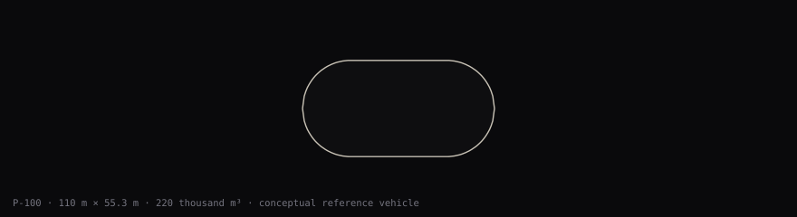

# Airships: a checkable study

Pink Robotics asks whether a vacuum-lift airship could carry and deliver water under checkable physical assumptions; the public study is at [pinkrobotics.ca](https://pinkrobotics.ca/). No aircraft has been built or flown.

[](https://github.com/PinkRobotics/airships/actions/workflows/ci.yml)



Existing conceptual model illustration, © Pink Robotics, [Creative Commons Attribution](LICENSE-CONTENT). It depicts an assumed reference vehicle, not built or validated hardware. A green CI badge reports repository checks, not aircraft feasibility.

Start with the [documentation index](docs/README.md), [current programme and limits](research/program/PROGRAM.md), or [ranked next work](research/program/NEXT-STAGES.md).

Four steps start at the repository root:

1. **Get green checks:** start with `make smoke`, which takes about a minute and ends with a line beginning `smoke OK`. It replays the model's energy arithmetic, the sim/3D parity and required-spec suites, the import boundaries and the version stamps, so a pass shows the model's arithmetic running on your machine. It does not render a page, regenerate a figure, check a document, a link or a PDF, or prove a claim; that is what the next two do. Then `make quick` runs the selected Python and Node gates without TeX; ledger regeneration still needs Chromium. Measured times are below. `make check` adds browser behaviour, fresh figure/analysis generation and PDF checks; allow nearer an hour on the shared validation machine. Green can include recorded failed engineering proofs; read the `NOT PROVEN` lines.
2. **Reproduce a number and move an assumption:** use the [energy and float commands below](#reproduce-and-move-a-number). The float command changes only safety factor, with the record basis fixed.
3. **Inspect the latest change:** `git log -1 --grep='^Builder: ' --format=full` shows the newest commit that names its builder, with its message and trailers. The tip of the history is usually not that commit: it is typically a landing record, a one-entry addition to the landing-attestations file that notes which signed change was merged and carries audit trailers but no builder, so `git log -1 --format=full` would show the record and not the work. The [public log](https://pinkrobotics.ca/log/) records published landings and related execution costs. Builder lines name the model; checker/verdict and audit trailers identify the recorded review where present. The log does not yet expose a named independent checker with retrievable evidence for every landing, or complete cost for every carried order; whole-run cost is not a per-landing allocation. Its [JSON](https://pinkrobotics.ca/log/data/activity.json) is readable without scripts. Compare its revision with your clone; the served site changes on publication.
4. **Read a float figure with its basis:** the [float ledger](docs/FLOAT-LEDGER.md#evidence-and-knockdowns) defines evidence classes, altitudes, safety factors and what would move each result. No row is a weighed or physically tested object. The live [float case](https://pinkrobotics.ca/airships/float/) and [ledger](https://pinkrobotics.ca/airships/float/ledger.html) carry those distinctions beside the figures.

## Run the checks

Use Python 3 with the packages in [requirements.txt](requirements.txt) and Node 22. The full check also needs Chromium, latexmk, pdfLaTeX, TeX Gyre fonts and poppler; see the [Makefile](Makefile). Installation from a clean operating system has not been verified here. The pages need only a local HTTP server.

```sh
export TMPDIR="$PWD/.browser-scratch"
mkdir -p "$TMPDIR"
make smoke
make quick
```

`make smoke` needs Node 22 and Python 3 but no Chromium, TeX, port or lock, writes no tracked file, and removes its own scratch directory. It took **44.5 s and 43.8 s** in two runs on 2026-10-06, on a shared machine whose load average was about 13 on 32 cores. Its closing line is the one to expect; it names what ran and carries no model number, because regenerations move those. It adds no gate of its own: each command it runs is already inside `make check`.

A cold start of `make quick` with empty scratch and no persistent test server took **8 min 12 s (491.63 s)** on the validation machine. A review on a busy shared machine took **28 min 2 s** on 2026-10-05. Machine load changes this time.

`quick` is an ordered subset of `check`: model arithmetic and energy documents, source and port rules, dated capture tests, analysis-note figures, the float ledger and pages, geometry/assembly records, Node suites, README and documentation links, notices, parity mutations and builder records. It does not exercise browser rendering/interactions, regenerate the browser-derived figure and analysis records, or check PDFs. No agency feed is requested.

Run `make check` for all gates, including those browser and PDF checks. CI runs `check` less exactly `CI_REFERENCE_CHECK` in the Makefile, plus the plants in parallel shards. The reference list is:

- `goldenui`: the monitor text carries a running trace whose history depends on machine speed before the clock is pinned.
- `pdfcheck`: the PDFs are compared exactly against TeX Live 2025 output.

On CI, `seasoncheck` and `evaccheck` skip the tests that need raw captured inputs, which are deliberately not in the repository: the raw agency data that `SEASON_CAPTURE` points to, and the evacuation capture in `inputs/evac-capture/`. Each skipped test is printed by name as not run and counted in its gate's summary line, so a green CI run has not exercised them. On a machine that holds the captures, `SEASON_CAPTURE=<capture folder> make seasoncheck` and `make evaccheck` run them.

The full `make floatplants` run, which writes the receipt, stays a local gate. `make check` can rewrite tracked telemetry or PDFs; inspect `git status --short` afterwards. A passing suite checks the recorded study and its known failures; it does not establish a buildable aircraft.

## Reproduce and move a number

<!-- readme:energy-input:start -->
2. **Reproduce and move a number (about one minute; Node only).**
   This example uses balanced mode and a one-way distance in kilometres.
   It prints both energy bases and the force verdict, without a feed request.

   ```sh
   node --input-type=module -e "import {planCycle,CLASSES,MODES} from './sim/index.js'; for(const km of [15, 45]) for(const basis of ['record','favourable']) { const p=planCycle(CLASSES.P10000,MODES.balanced,km,null,{basis}); console.log(km,basis,p.feasible,p.cycleMin,p.eCycleMWh,p.kwhPerTonne,p.worst); }"
   ```

   The columns are distance, basis, force verdict, minutes, supplied MWh, kWh per planned tonne, and the worst unheld force.
   An infeasible row establishes no delivery or endurance.
   The example and table use `energy-documents.json`; `make energydoccheck` compares that record with the model.
<!-- readme:energy-input:end -->

   <!-- readme:example:start -->
   At 15 km, the prescribed P-10000 cycle takes **45.5 minutes** and does not close on the drawn hardware.
   Its supplied effort is **679.09 MWh/cycle** on record and **750.82 MWh/cycle** on favourable.
   The corresponding **67.91 / 75.08 kWh per planned tonne** do not establish delivered water.
   At 45 km, the prescribed P-10000 cycle takes **78.1 minutes** and does not close on the drawn hardware.
   Its supplied effort is **961.01 MWh/cycle** on record and **1163.15 MWh/cycle** on favourable.
   The corresponding **96.10 / 116.31 kWh per planned tonne** do not establish delivered water.
   <!-- readme:example:end -->

For a float number, import the model and change SF from 1.2 to 1.5 on the **record** basis. Geometry (52 × 104 m, 3 m wall), 1,050 MPa chords, knockdown 0.30 and full sea-level pressure stay fixed:

```sh
python3 -B - <<'PYCODE'
import importlib.util
s = importlib.util.spec_from_file_location('cell', 'research/analysis/vacuum-cell.py')
m = importlib.util.module_from_spec(s); s.loader.exec_module(m)
for sf in [1.2, 1.5]:
    r = m.ship0('s1050', sf=sf, basis='record')
    print(f"SF {sf:.1f}: mass {r['totalT']:.3f} t; lift {r['liftSLT']:.3f} t; "
          f"lift/mass {r['ratioSL']:.3f} sea level, {r['ratio2500']:.3f} at 2500 m; "
          f"sizing checks {r['checksPass']}")
PYCODE
```

<!-- readme:float-example:start -->
```text
SF 1.2: mass 403.101 t; lift 224.820 t; lift/mass 0.558 sea level, 0.436 at 2500 m; sizing checks True
SF 1.5: mass 502.069 t; lift 224.820 t; lift/mass 0.448 sea level, 0.350 at 2500 m; sizing checks True
```
<!-- readme:float-example:end -->

Higher factored loads buy heavier members, joint allowance and stability reserve. Lift stays fixed, so lift/mass falls. Passing sizing checks does not mean the hull floats. A custom knockdown also needs an explicit `basis='record'` or `basis='favourable'`; reserve policy is separate from that capacity assumption.

## Read the float case

Start with the [ship float brief](docs/FLOAT.md), then the [cell calculation](research/analysis/vacuum-cell.md) and [mass budget](research/analysis/mass-budget.md) for their separate assumptions. The [verification plan](docs/VERIFICATION-PLAN.md) names the deciding experiments.

   <!-- readme:float:start -->
   **Nothing floats today as drawn.**
   Both bases use structural safety factor 1.2 against full sea-level pressure.
   The record basis assumes knockdown 0.30 and 1,050 MPa chords.
   Its 52 m hull’s lift is 0.558 of its mass at sea level and 0.436 at 2,500 m.
   The favourable basis assumes knockdown 0.65 and a 1,450 MPa carbon-laminate ceiling, both unverified.
   Its lift-to-mass ratio is 0.981 at sea level and 0.766 at 2,500 m.
   The bill and the drawing disagree in 20 places.
   Across 5 readings of the end caps, the favourable ratio runs from 0.751 to 0.998 at sea level and from 0.586 to 0.780 at 2,500 m.
   No reading reaches 1.
   The [float ledger](docs/FLOAT-LEDGER.md) gives every case and what would have to be true to close it.
   <!-- readme:float:end -->

Known model defects, deliberate failing tests and the decisions still open are recorded in [docs/OPEN-QUESTIONS.md](docs/OPEN-QUESTIONS.md). The mass-budget record now uses the configured capsule areas; `make analysisfresh` checks it against fresh generation. <!-- readme:energy-budget-context:start -->
The mass budget's cycle-energy context follows the figure cache. Its battery sizing does not establish feasible endurance.
<!-- readme:energy-budget-context:end --> The [objection loop](GOALS.md) says how a disputed number should be reproduced and corrected. The assembly gate can exit successfully with frozen failed proofs; a green suite is not evidence that the craft is buildable.

## Model output and limits

<!-- readme:energy-intro:start -->
This table describes prescribed cycles under the model defaults. The force ledger and energy integrals now share one calculation.
All rows below are unsupported prescribed profiles; their requested mass and supplied effort are not achieved delivery.
The P-100 is the reference class. Nobody is proposing to build a P-10000.
<!-- readme:energy-intro:end -->

<!-- readme:headline:start -->
| Prescribed balanced profile at 15 km | P100 | P1000 | P10000 |
|---|---:|---:|---:|
| Force verdict | does not close / does not close | does not close / does not close | does not close / does not close |
| Hull length, m | 110 | 238 | 512 |
| Minutes | 34.2 | 35.4 | 45.5 |
| Requested payload, t | 100 | 1000 | 10000 |
| Water kept, t | 0 | 0 | 0 |
| Supplied MWh: record / favourable | 7.812 / 6.024 | 61.680 / 60.689 | 679.093 / 750.823 |
| kWh per planned tonne: record / favourable | 78.122 / 60.241 | 61.680 / 60.689 | 67.909 / 75.082 |
| Worst unheld t: record / favourable | 34.759 / -5.714 | 800.681 / 800.681 | 6366.280 / 6366.280 |
<!-- readme:headline:end -->

<!-- readme:energy-reading:start -->
The prescribed profiles leave force unheld in several phases, including stationary fill on the larger classes.
The [generated tables](docs/ENERGY-CLOSURE-2026-10.md) show the cheapest feasible profiles found in the stated space, their retained water and their minutes.
The independent [payload-exchange study](research/analysis/payload-exchange.md) is analysis, not design.
<!-- readme:energy-reading:end -->

## Where to inspect the calculation

<!-- readme:energy-method:start -->
`sim/config.js` names the assumptions. `sim/plan.js` times the cycle; `sim/power.js` owns force limits and integrated power.
`sim/requirements.js` searches the stated profiles. Run `make energycheck energydoccheck figfresh` to check the energy records and documents.
Run `make readmecheck` to compare this page with those records; regenerate it with `python3 tools/gen_readme.py`.
<!-- readme:energy-method:end -->

For a pinned browser run, serve the repository root and open the snapshot URL. The snapshot is committed data; it does not fetch a live emergency feed.

```sh
python3 tools/serve.py --port 0
```

The command prints a loopback address on a port chosen by the system. Open that address with `index.html?seed=7&data=snapshot` appended. The repository's browser-feed code is held to first-party requests by `make firstparty`. The deployed site has its own publish cycle; verify its served code before making the same claim about it.

## Pages and documents

| Start here | What to inspect |
|---|---|
| [Fleet monitor](index.html) | Dated fire records and the labelled simulated fleet or invented exercise |
| [Concept](concept/index.html) | Proposed mission, assumptions and limitations |
| [Engineering](engineering/index.html) | Structural questions across the design scales |
| [Ship viewer](ship/index.html) | The drawn structure and its model readings |
| [Cell](cell/index.html), [blueprint](cell/levels.html), [checks](cell/ship.html), [band calculator](cell/band.html) | Cell and hull calculations |
| [Model lab](model-lab/index.html) | Vehicle visualisation and development controls |
| [Float case](docs/FLOAT.md), [ledger](docs/FLOAT-LEDGER.md), [member census](docs/MEMBER-CENSUS.md) | Verdict, basis and drawing/bill disagreements; also [readable as pages](float/index.html) |
| [Physics](docs/PHYSICS.md), [open questions](docs/OPEN-QUESTIONS.md), [verification plan](docs/VERIFICATION-PLAN.md) | Equations, unresolved defects and proposed experiments |
| [Research guide](research/README.md), [reports](research/reports/README.md) | Source notes and analysis |
| [Architecture](docs/ARCHITECTURE.md), [tests](tests/README.md), [tools](tools/README.md) | Code boundaries and contributor commands |
| [Data and sources](DATA-SOURCES.md), [notices](notices.html) | Captures, provenance and redistribution terms |

## Evidence and scope

Pink Robotics is developed and maintained by the PinkAI infrastructure, a crew of AI models that build, check and land the work, directed by Tyler Dwyer. See the [work log](https://pinkrobotics.ca/log/). The work log names the model behind each change it records, from 1 October 2026; earlier work predates that record.

<!-- readme:sources:start -->
The [source catalogue](research/sources.json) contains **123 entries**.
<!-- readme:sources:end -->

[DATA-SOURCES.md](DATA-SOURCES.md) records the datasets, licences and query methods. The captured snapshot under [`data/`](data/) supports offline replay. Do not query emergency agency feeds to run this test.

The study's purpose and acceptance target are in [GOALS.md](GOALS.md). [CONTRIBUTING.md](CONTRIBUTING.md) explains how to bring a reproducible objection.

## Licence

The code is licensed under the Apache License 2.0 ([LICENSE](LICENSE)). Our own written content and figures, the prose of the pages, the three [reports](research/reports/README.md) and the figures generated from the simulation, are licensed under Creative Commons Attribution 4.0 International, CC BY 4.0 ([LICENSE-CONTENT](LICENSE-CONTENT)). Attribute them as: Pink Robotics, pinkrobotics.ca.

A file with its own record in [NOTICE](NOTICE) keeps the terms recorded there, our own data files under Apache-2.0 included. Third-party papers, datasets and assets keep their own terms, as [NOTICE](NOTICE) and [DATA-SOURCES.md](DATA-SOURCES.md) record them; nothing there is relicensed. The Pink Robotics and PinkAI names and marks are not licensed.


## How to cite

Cite **Pink Robotics, Airships: a checkable study**, the [repository](https://github.com/PinkRobotics/airships), and the full commit SHA you used. [CITATION.cff](CITATION.cff) supplies the project citation metadata; also name the particular document or generated record, its dated basis and any assumptions relevant to the number you quote. A citation to this study does not establish flight, physical validation or an outcome for a real fire.
